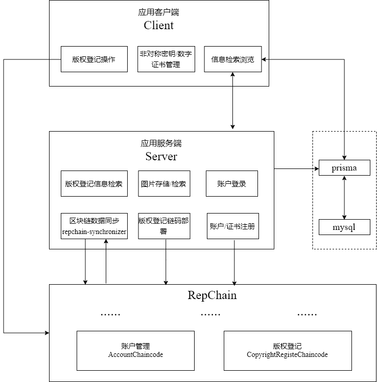
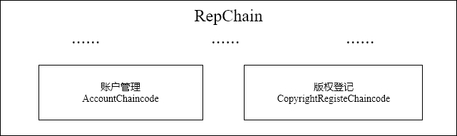
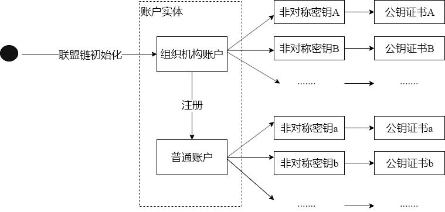
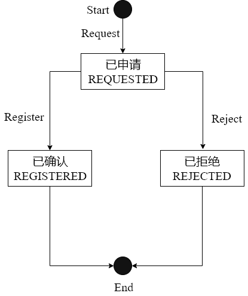
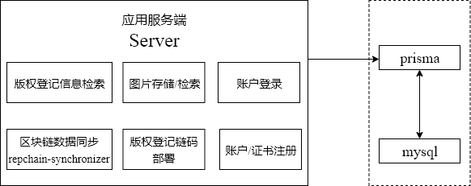
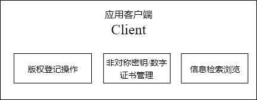

# RepChain Dapp 开发示例教程
*Keywords: RepChain, Blockchain, Dapp*

本教程通过对一个具体应用场景的实现，向大家介绍基于RepChain的区块链应用的开发过程，希望能对正在学习RepChain以及区块链应用开发的老铁们有所帮助。
## 背景介绍
RepChain(https://gitee.com/BTAJL/repchain) 是由中科院软件所开源的一款区块链基础平台，适用于构建联盟链及其应用。

我们的目标是构建一个基于RepChain的图片版权登记应用。

首先给它取个名字，简单粗暴点，就叫Copyright Register Based on Blockchain吧，为了方便就简写为CRBB。

对CRBB的特点与功能概述如下：
1. 若干组织机构基于RepChain组建需授权准入的区块链系统，即联盟链；
2. 联盟链依靠其防篡改特性，对用户的版权登记操作进行可信见证；
3. 版权登记操作包括：请求登记、确认登记或拒绝登记；
4. 应用中有2类用户角色：机构用户和普通用户
5. 图片版权登记请求功能：普通用户可以选择并上传其本地图片以请求登记版权;
6. 图片版权登记审核功能：机构用户可以对普通用户的版权登记申请进行审核，并进行确认登记或拒绝登记的操作;
7. 图片版权登记情况浏览：所有用户可以浏览查看系统中所有的图片版权登记情况，如登记状态、图片名称、图片描述等；
8. 图片版权登记状态分为3种：已请求、已登记和已拒绝
### 应用架构
下图展示了CRBB的系统架构



主要构成有：
- RepChain区块链网络
- 应用服务端
- 应用客户端 

### RepChain

- 由模拟的多个组织机构节点建立的联盟链;
- 内置了账户管理链码/合约(AccountChaincode)，组织机构账户在联盟链构建时初始化生成；组织机构账户可以通过调用AccountChaincode注册普通账户;
- 应用服务端可通过构建提交链码部署交易来在RepChain中部署版权登记链码/合约（CopyrightRegisterChaincode);版权登记链码主要对用户的版权登记操作进行防篡改存证
#### 账户模型


如上图所示, RepChain使用了简洁的账户模型，将参与联盟链的账户分为了2类：
- 组织机构账户: 联盟链初始化时即生成
- 普通账户: 通过组织机构账户进行注册

每个账户实体拥有唯一的账户标识ID，如社会信用代码/身份证。

而每个账户实体可以拥有若干份非对称密钥及对应的公钥证书。

与公有链不同的是，这里公钥只是验证数字身份的工具，而不是账户的数字身份表示，真正代表其身份的是账户实体。

而公钥证书需要被机构账户注册到RepChain中才能与账户的身份进行绑定。一个账户下的每个公钥证书拥有唯一的证书名称。

账户发起操作时，需要使用其拥有的某个非对称密钥的私钥来构建已签名的区块链交易，并在交易中申明签名账户的ID以及所使用私钥对应的公钥证书名称。

在这里，我们的上层应用没有自己独立的账户模型，而是直接使用RepChain的账户模型与账户数据。
> Note: 在CRBB的实现中，组织机构账户以及普通账户各自都只使用一份非对称密钥。
#### 版权登记链码
版权登记链码与我们应用的业务逻辑直接相关，需由我们应用开发者自行设计与实现。

对图片的版权登记过程，我们设计如下图所示的简单状态转移逻辑:


- 由登记申请者(普通用户)申请后，版权登记状态为“已申请”；
- 在“已申请”状态，由登记审核者(组织机构用户)同意登记后，版权登记状态为“已确认”；
- 在“已申请”状态，由登记审核者(组织机构用户)拒绝登记后，版权登记状态为“已拒绝”。

对应地，我们的链码主要需实现上述3个状态转移方法：Request、Register以及Reject
### RepChain区块链数据同步工具repchain-synchronizer
组建RepChain联盟链的节点本身，专注于执行交易及共识等任务，目前未提供繁重的数据查询服务。而我们需要从底层的区块链数据中构建上层的应用业务数据，这需要借助区块链数据同步工具repchain-synchronizer。
### RepChain开发包RCJS 
RepChain Client提供了与RepChain交互的工具包，包括与RepChain兼容的非对称密钥/数字证书生成、RepChain交易的签名构建以及交易提交等。

其JavaScript版本RCJS(RepChain Client JavaScript, https://gitee.com/BTAJL/RCJS/tree/dev_zj_preview/) 兼容Browser与Node环境。在CRBB的Server与Client中使用RCJS与RepChain进行交互。
### 应用服务端


应用服务端，为版权登记业务提供必要的支撑服务。包括：
- 利用repchain-synchronizer从区块链数据中同步版权登记信息，并向应用客户端提供版权登记信息检索浏览服务；
- 接收及存储应用客户端申请登记版权时提交的图片，并向应用客户端提供图片检索浏览服务；
- 基于repchain-synchronizer从区块链数据中同步得到的账户数据，向应用客户端提供账户注册与登录身份验证服务；
- 基于参与构建RepChain联盟链的某个组织机构的数字身份与密钥材料，构建及提交链码部署交易到RepChain中，以部署版权登记链码

> Note: 应用服务端使用了Prisma来代替传统ORM，并由Prisma直接向应用客户端提供区块、交易数据的检索浏览服务。
### 应用客户端


为用户提供应用的业务操作接口，包括：
- 非对称密钥/数字证书管理：
    + 生成普通用户的非对称密钥，并对私钥进行加密保护存储；
        > Note: **在我们的应用模式中，为了安全性，私钥只由用户的客户端掌握，服务端不存储其私钥，用户需自己备份保管其私钥; 服务端也不存储用户用于加密其私钥的密码，该密码也由用户自行保管**
    + 生成普通用户的自签名数字证书；
    + 导入用户的非对称密钥/数字证书信息；
    + 导出用户的非对称密钥/数字证书信息。
- 信息检索浏览：
    + 所有用户，可检索浏览版权登记信息；
    + 所有用户，可检索浏览系统中的所有区块链交易信息；
    + 所有用户，可检索浏览系统中的所有区块链区块信息；
- 版权登记操作：
    + 普通用户，可申请登记图片版权；
    + 机构用户，可审核版权登记请求，并确认登记或拒绝登记；
    + 根据不同的版权登记操作，构建调用版权登记链码的签名交易，并直接与RepChain交互，将交易提交给RepChain联盟链。

## 开发详情
下面介绍CRBB的详细开发过程，实现后的完整代码已托管同步到码云(https://gitee.com/linkel/CRBBV1.0) 。
### RepChain开发环境搭建
首先，我们需要搭建好RepChain的开发环境，这可以参考[RepChain开发者指南(V 1.0)](https://gitee.com/BTAJL/repchain/attach_files) 。搭建好环境后，需开启运行单机多节点的联盟链模拟模式。开启运行后，默认将在localhost:8081向上层应用提供与RepChain的交互服务。
### Chaincode开发
目前RepChain只支持Scala语言编写的chaincode，因此，我们使用Scala来实现版权登记链码。若未接触过Scala，需先自行学习了解。

根据我们在背景介绍中对[版权登记链码](#版权登记链码)的设计，我们编写如下所示的链码:
```scala
// server/src/RepChain/copyrightRegisterChaincode.scala

// 外界调用链码方法时传入的参数是Json字符串，需要进行解析
// 并且我们在存储worldState的value时其值也使用Json字符串
import org.json4s.DefaultFormats
import org.json4s.jackson.JsonMethods.parse
import org.json4s.jackson.Serialization.{write, read}
import rep.protos.peer.ActionResult
import rep.sc.scalax.{ContractContext, IContract, ContractException}

final case class RequestParams( // 请求登记方法接受的参数结构
    hashArray: Array[String], // 图片的哈希值(支持一次对多张图片申请登记版权)
    hashAlg: String,          // 计算图片哈希值所用哈希算法
    desc: String,             // 对图片的描述
    name: String              // 图片的名称
);
final case class ReviewParams( // 确认登记方法和拒绝登记方法接受的参数结构
    hashArray: Array[String], // 图片的哈希值(支持一次确认/拒绝多张图片的版权请求)
    notes: String             // 确认登记或拒绝登记时的备注信息
);

class CopyrightRegister extends IContract { // 链码/合约都必需继承IContract类

    val STATUS_REQUESTED = "REQUESTED";
    val STATUS_REGISTERED = "REGISTERED";
    val STATUS_REJECTED = "REJECTED";

    // 记录影响版权登记信息的相关交易ID的数据结构
    final case class Txs (requestTx: String, registerTx: String, rejectTx: String);
    // 记录影响版权登记信息的相关备注信息的数据结构
    final case class Notes (requestNotes: String, registerNotes: String, rejectNotes: String);

    final case class CopyrightRegistration( // 用于持久化版权登记信息worldState的数据结构，
        status: String, // 版权登记状态
        owner: String,  // 版权主张者的账户Id
        hash: String,   // 图片哈希值 
        hashAlg: String,// 计算图片哈系值时使用的哈希算法
        desc: String,   // 图片描述
        name: String,   // 图片名称
        txs: Txs,       // 相关交易
        notes: Notes    // 相关备注信息
    );

    // Json序列化与反序列化时使用的格式
    implicit val formats = DefaultFormats;

    // 链码的初始化方法
    override def init(ctx: ContractContext) {
        println(s"init copyright register contract with tx: ${ctx.t.id}")
    }

    /**
    * 链码的请求登记方法
    *
    * @param ctx 
    * @param data
    * @return
    */
    def request(ctx: ContractContext, data: RequestParams): ActionResult = {
        // 通过ContractContext可以获得当前所执行交易的信息
        for(i <- 0 until data.hashArray.length) {
            val key = data.hashArray(i);
            val pvAny = ctx.api.getVal(key);
            if(pvAny != null) {
                // 通过使用ContractException可以抛出链码执行异常
                throw ContractException(s"图像(hash: ${key})版权登记申请记录已存在，不能再次申请");
            }
            var imageName = data.name;
            if (data.hashArray.length > 1) {
                imageName += "-" + i
            }
            val value = CopyrightRegistration(
                STATUS_REQUESTED, 
                ctx.t.getSignature.getCertId.creditCode,
                key,
                data.hashAlg,
                data.desc,
                imageName,
                txs = Txs(ctx.t.id, "", ""),
                notes = Notes("copyright register request", "", "")
            );
            // 对value序列化为Json字符串后再持久化
            ctx.api.setVal(key, write(value));
            println("copyright registration request: "+ key + ": " + value);
        }
        
        null
    }

    /**
    * 链码的确认登记方法
    *
    * @param ctx 
    * @param data
    * @return
    */
    def register(ctx: ContractContext, data: ReviewParams): ActionResult = {
        val isAuthority = ctx.api.bNodeCreditCode(ctx.t.getSignature.getCertId.creditCode)
        if (!isAuthority) {
            throw ContractException(s"发起者不是机构用户，拒绝该操作!");
        }

        for(hash <- data.hashArray) {
            val key = hash;
            val pvAny = ctx.api.getVal(key);
            if(pvAny == null) {
                throw ContractException(s"图像(hash: ${key})版权未被预先申请登记，不能确认登记");
            } else if (read[CopyrightRegistration](pvAny.asInstanceOf[String]).status != STATUS_REQUESTED) {
                throw ContractException(s"图像(hash: ${key})版权登记已被确认或拒绝，不能再确认登记");
            }
            var pv = read[CopyrightRegistration](pvAny.asInstanceOf[String]);
            var value = pv.copy(
                status = STATUS_REGISTERED,
                txs = pv.txs.copy(registerTx = ctx.t.id),
                notes = pv.notes.copy(registerNotes = data.notes)
            );
            ctx.api.setVal(key, write(value));
            println("copyright registration register: "+ key + ": " + value);
        }
        
        null
    }

    /**
    * 链码的拒绝登记方法
    *
    * @param ctx 
    * @param data
    * @return
    */
    def reject(ctx: ContractContext, data: ReviewParams): ActionResult = {
        val isAuthority = ctx.api.bNodeCreditCode(ctx.t.getSignature.getCertId.creditCode)
        if (!isAuthority) {
            throw ContractException(s"发起者不是机构用户，拒绝该操作!");
        }

        for(hash <- data.hashArray) {
            val key = hash;
            val pvAny = ctx.api.getVal(key);
            if(pvAny == null) {
                throw ContractException(s"图像(hash: ${key})版权未被预先申请登记，不能拒绝登记");
            } else if (read[CopyrightRegistration](pvAny.asInstanceOf[String]).status != STATUS_REQUESTED) {
                throw ContractException(s"图像(hash: ${key})版权登记已被确认或拒绝，不能再拒绝登记");
            }
            var pv = read[CopyrightRegistration](pvAny.asInstanceOf[String]);
            var value = pv.copy(
                status = STATUS_REJECTED,
                txs = pv.txs.copy(rejectTx = ctx.t.id),
                notes = pv.notes.copy(rejectNotes = data.notes)
            );
            ctx.api.setVal(key, write(value));
            println("copyright registration reject: "+ key + ": " + value);
        }

        null
    }   

    // 对外界提供的链码方法名称分别为Request、Register和Reject
    // 外界调用上述链码方法时提供的参数必须为满足RequestParams或ReviewParams结构的Json字符串
    override def onAction(ctx: ContractContext, action: String, sdata: String): ActionResult = {
        println("-----------"+sdata);

        val json = parse(sdata);

        action match { 
            case "Request" =>
                request(ctx, json.extract[RequestParams])
            case "Register" =>
                register(ctx, json.extract[ReviewParams])
            case "Reject" =>
                reject(ctx, json.extract[ReviewParams])
        }
    }
}
```
上述链码主要实现了版权登记相关操作方法：request、register和reject，对外界提供的方法名称为Request、Register和Reject以分别进行请求登记、确认登记和拒绝登记操作。

RepChain的链码机制提供对业务状态（worldState）的持久化操作，其持久化是基于KV数据库（当前是使用LevelDB）的，如下所示，在链码的worldState中将版权登记信息以Json字符串方式进行持久化。
```scala
// 对value序列化为Json字符串后再持久化
ctx.api.setVal(key, write(value));
```

此外，我们限定了只有机构用户才有权限调用register和reject方法:
```scala
val isAuthority = ctx.api.bNodeCreditCode(ctx.t.getSignature.getCertId.creditCode)
if (!isAuthority) {
    throw ContractException(s"发起者不是机构用户，拒绝该操作!");
}
```
版权登记链码编写完成后，我们便可以通过签名构造和提交链码部署交易来将该链码部署到RepChain中。不过，我们将在应用服务端中实现自动部署该版权登记链码。

### 应用服务端开发
我们基于NodeJS实现应用服务端。为了便于开发，我们使用Express(https://expressjs.com/) 来快速创建后端服务，使用Prisma和MySQL管理持久化数据，并使用Docker容器来运行管理Prisma和MySQL。

此外，我们使用repchain-synchronizer(https://gitee.com/linkel/repchain-synchronizer) 来同步RepChain区块链数据。

使用RCJS(https://gitee.com/BTAJL/RCJS/tree/dev_zj_preview/) 来构建和向RepChain提交签名交易。

#### API
在应用服务端实现面向客户端的API：
```JavaScript
// server/src/route.js

const setRoute = (app) => {
    app.use("/images", imagesRouter)
        .use("/copRegs", copRegsRouter)
        .use("/auth", authRouter);
}; 
```
分别提供图片存储与检索浏览、版权登记信息检索浏览和账户注册与登录服务。
```JavaScript
// server/src/api/images.js

const imagesRouter = Router();
// GET /images/:imageId/download
imagesRouter.get("/:imageId/download", [validateHandlers.ImageDownload, tokenVerifyHandler, downloadHandler]);
// POST /images
imagesRouter.post("/", [uploadHandler, validateHandlers.ImageUpload, tokenVerifyHandler, storeHandler]);
```
```JavaScript
// server/src/api/copRegs.js

const copRegsRouter = Router();
// GET /copRegs
copRegsRouter.get("/", [validateHandlers.CopRegListQuery, tokenVerifyHandler, copRegListQueryHandler]);
// GET /copRegs/:copRegId
copRegsRouter.get("/:copRegId", [validateHandlers.CopRegQuery, tokenVerifyHandler, copRegQueryHandler]);
```
版权登记信息并没有相应的POST操作API，因为其数据信息是从已同步的区块链数据中构建的。
```JavaScript
// server/src/api/auth.js

const authRouter = Router();
// POST /auth/login
authRouter.post("/login", [validateHandlers.authLogin, loginHandler]);
// POST /auth/register
authRouter.post("/register", [validateHandlers.authRegister, registerHandler]);
```
#### 数据持久化
我们基于Prisma和MySQL来持久化应用数据，而基于GraphQL我们有如下所示的schema定义:
```graphql
# server/src/db/prisma/datamodel.gql

type ImageMeta {
    id: ID! @unique
    hash: String! @unique
    hashAlg: String!
    name: String!
    desc: String!
    storagePath: String,
    url: String
}

enum RegisterStatus {
    REQUESTED
    REGISTERED
    REJECTED
}

type CopyrightRegistration {
    id: ID! @unique
    copRegKey: String! @unique
    ownerId: String!
    requestTxId: String
    registerTxId: String 
    rejectTxId: String 
    requestNotes: String
    registerNotes: String
    rejectNotes: String
    status: RegisterStatus!
    image: ImageMeta
}
```
上述结构即是应用服务端面向应用客户端所提供数据的结构。

对Prisma，有如下所示的配置：
```yaml
# server/src/db/prisma/prisma.yml

# Specifies the HTTP endpoint of your Prisma API.
endpoint: http://localhost:4466

# Defines your models, each model is mapped to the database as a table.
datamodel: 
  - ../generated/rsDatamodel.gql
  - datamodel.gql

# Specifies the language and directory for the generated Prisma client.
generate:
  - generator: javascript-client
    output: ../generated/prisma-client/

# Ensures Prisma client is re-generated after a datamodel change.
hooks:
  post-deploy:
    - prisma generate
```
其中，持久化的数据结构定义有2个：datamodel.gql和rsDatamodel.gql，前者即是我们在前面所定义的，而后者是repchain-synchronizer所提供的，包括了对交易、区块以及账户等的数据结构定义。

在成功部署Prisma后，将生成prisma-client，可被服务端用来与Prisma交互。

我们使用Docker容器运行Prisma和MySQL，因此有如下所示的docker-compose配置：
```yaml
# server/src/db/prisma/docker-compose.yml

version: '3'
services:
  prisma:
    image: prismagraphql/prisma:1.29
    container_name: prisma_crbb
    restart: always
    ports:
    - "4466:4466"
    environment:
      PRISMA_CONFIG: |
        port: 4466
        # uncomment the next line and provide the env var PRISMA_MANAGEMENT_API_SECRET=my-secret to activate cluster security
        # managementApiSecret: my-secret
        databases:
          default:
            connector: mysql
            host: mysql
            port: 3306
            user: root
            password: prisma
            migrations: true
  mysql:
    image: mysql:5.7
    container_name: mysql_crbb
    restart: always
    ports:
    - "3306:3306"
    environment:
      MYSQL_ROOT_PASSWORD: prisma
    volumes:
      - mysql_crbb:/var/lib/mysql
volumes:
  mysql_crbb:
```
#### 区块链数据同步 
我们需要对RepChain的区块链数据进行同步，并从中构建业务数据，包括账户以及版权登记信息等。

使用repchain-synchronizer可同步RepChain区块链数据到数据库中，并且通过repchain-synchronizer提供的subscribeObserver方法可以订阅观察账户管理链码和版权登记链码的状态变化，以进一步构建我们的业务数据。

下面展示了同步区块链数据与观察版权登记链码状态变化以构建本地版权登记信息的实现细节：
```JavaScript
// server/src/RepChain/repchainSynchronize.js

import RepChainSynchronizer from "repchain-synchronizer";
import config from "config";
import { prisma } from "../db/generated/prisma-client";
import serverInnerLogger from "../log/serverInnerLog";
import CopRegObserver from "../copRegs/copRegObserver";

export const repChainSynchronizer = new RepChainSynchronizer({
    url: config.get("RepChain.default.url_api"),
    subscribeUrl: config.get("RepChain.default.url_subscribe"),
    prisma,
    logPath: config.get("Log.repchainSynchronizerLogPath"),
});

export const synchronizeRepchain = () => {
    repChainSynchronizer.subscribeObserver(new CopRegObserver());
    repChainSynchronizer.startSync();
    serverInnerLogger.info("Started the repchain synchronizer");
};
```
```JavaScript
// server/src/copRegs/copRegObserver.js

import cfg from "config";
import { parseWorldStateValue } from "repchain-synchronizer";
import serverInnerLogger from "../log/serverInnerLog";
import { getWSConnections } from "../api/realtime";
import { copRegFragment } from "./copRegs";
import { prisma } from "../db/generated/prisma-client";

class CopRegObserver {
    // eslint-disable-next-line class-methods-use-this
    _isMatch(worldState) {
        const { chaincodeName } = cfg.get("RepChain");
        return worldState.chaincodeName === chaincodeName
            && worldState.functions.length > 0;
    }

    async update(worldState) {
        if (!this._isMatch(worldState)) return;
        const valueBuf = Buffer.from(worldState.value, "hex");
        const copRegJsonStr = parseWorldStateValue("Default", valueBuf);
        const copReg = JSON.parse(copRegJsonStr);

        if (copReg.status === "REQUESTED") { // should create
            const {
                status, hash, hashAlg, name, desc,
            } = copReg;
            // eslint-disable-next-line no-await-in-loop
            const ownerId = await prisma.account({ creditCode: copReg.owner }).id();
            // eslint-disable-next-line no-await-in-loop
            const requestTxId = await prisma.transaction({ txid: copReg.txs.requestTx }).id();
            const create = {
                copRegKey: worldState.key,
                status,
                ownerId,
                requestTxId,
                requestNotes: copReg.notes.requestNotes,
                image: {
                    create: {
                        hash, hashAlg, name, desc,
                    },
                },
            };
            prisma.createCopyrightRegistration(create).$fragment(copRegFragment)
                .then((res) => {
                   ...... 
                });
        } else { // should update
            const update = {
                where: { copRegKey: worldState.key },
                data: {
                    status: copReg.status,
                },
            };
            if (copReg.status === "REGISTERED") {
                // eslint-disable-next-line no-await-in-loop
                const registerTxId = await prisma
                    .transaction({ txid: copReg.txs.registerTx }).id();
                update.data.registerTxId = registerTxId;
                update.data.registerNotes = copReg.notes.registerNotes;
            }
            if (copReg.status === "REJECTED") {
                // eslint-disable-next-line no-await-in-loop
                const rejectTxId = await prisma
                    .transaction({ txid: copReg.txs.rejectTx }).id();
                update.data.rejectTxId = rejectTxId;
                update.data.rejectNotes = copReg.notes.rejectNotes;
            }
            prisma.updateCopyrightRegistration(update).$fragment(copRegFragment)
                .then((res) => {
                    ......
                });
        }
    }
}
```
#### 链码自动部署
在应用服务端，我们实现自动部署版权登记链码到RepChain。
```JavaScript
// server/src/RepChain/deployChaincode.js

import cfg from "config";
import fs from "fs-extra";
import path from "path";
import { Transaction } from "rclink";
import { prisma } from "../db/generated/prisma-client";
import serverInnerLogger from "../log/serverInnerLog";
import signAndSendTx from "./signAndSendTransaction";

const deployChaincode = async () => {
    const { chaincodeName, chaincodeVersion } = cfg.get("RepChain");
    const latestChaincodeVersion = await prisma.chaincodeIDs({
        where: { chaincodeName },
        orderBy: "version_DESC",
    }).then((res) => {
        if (res) return res[0].version;
        return -1;
    });
    if (latestChaincodeVersion < chaincodeVersion) { // 部署更新的合约，覆盖已部署的最新版本
        serverInnerLogger.info(`Start to deploy the chaincode(name: ${chaincodeName}, version: ${chaincodeVersion})`);
        const chaincodeContent = fs.readFileSync(path.join(__dirname, "copyrightRegisterChaincode.scala")).toString();
        const chaincodeLegalProse = fs.readFileSync(path.join(__dirname, "copyrightRegisterChaincodeLegalProse")).toString();
        const txArgs = {
            type: "CHAINCODE_DEPLOY",
            chaincodeName,
            chaincodeVersion,
            chaincodeDeployParams: {
                timeout: 1000,
                codePackage: chaincodeContent,
                legalProse: chaincodeLegalProse,
                codeLanguageType: "CODE_SCALA",
            },
        };
        const tx = new Transaction(txArgs);
        signAndSendTx(tx)
            .then((res) => {
                if (res.err) {
                    const errMsg1 = `Failed to deploy the chaincode(name: ${chaincodeName}, version: ${chaincodeVersion}), `;
                    const errMsg2 = `with error message from RepChain: ${res.err}`;
                    serverInnerLogger.error(`${errMsg1}${errMsg2}`);
                } else {
                    const msg1 = `Deployed the chaincode(name: ${chaincodeName}, version: ${chaincodeVersion}), `;
                    const msg2 = "without any error message from RepChain";
                    serverInnerLogger.info(`${msg1}${msg2}`);
                }
                return 0;
            }).catch((err) => {
                const errMsg1 = `Failed to deploy the chaincode(name: ${chaincodeName}, version: ${chaincodeVersion}), `;
                const errMsg2 = `with error message ${err}`;
                serverInnerLogger.error(`${errMsg1}${errMsg2}`);
            });
    }
};
```
上述代码，根据config中的配置信息，构建部署合约的签名交易，并提交给RepChain。
#### 账户注册
RepChain联盟链由多个组织机构共同建立，而在应用服务端，我们使用代表其中一个组织机构的机构账户为应用的用户注册RepChain账户。即当客户端申请注册账户时，由服务端以该组织机构的非对称密钥构建签名交易，该交易调用RepChain的内置账户管理链码，并提交交易到RepChain联盟链网络。

以下代码展示了账户注册的关键逻辑实现：
```JavaScript
// server/src/api/authHandler.js

......

export const registerHandler = async (req, res) => {
    const {
        username, creditCode, phone, certPEM,
    } = req.body;

    // 本应用的用户注册过程需要先向RepChain注册账户，然后注册数字证书
    // RepChain已经内置了注册账户及证书的链码chaincode
    // 这里构造调用账户及证书注册链码方法的交易数据，并签名提交到RepChain网络

    // 首先订阅观察账户注册事件，以便下一步注册数字证书
    const accountRegisteredPromise = new Promise((resolve) => {
        const accountObserver = new (function AccountObserver() {
            const isMatch = worldState => worldState.chaincodeName === "ContractCert"
                && isEqual(worldState.functions, ["SignUpSigner"])
                && worldState.key === creditCode;
            this.update = (worldState) => {
                if (isMatch(worldState)) {
                    repChainSynchronizer.unsubscribeObserver(this);
                    resolve(true);
                }
            };
        })();
        repChainSynchronizer.subscribeObserver(accountObserver);
    });

    let chaincodeFunctionArgs = [JSON.stringify({
        name: username,
        creditCode,
        mobile: phone,
        certNames: [],
    })];
    let tx = new Transaction({
        type: "CHAINCODE_INVOKE",
        chaincodeName: "ContractCert",
        chaincodeVersion: 1,
        chaincodeInvokeParams: {
            chaincodeFunction: "SignUpSigner",
            chaincodeFunctionArgs,
        },
    });
    let result;
    try {
        result = await signAndSendTx(tx);
        if (result.err) {
            const errMsg1 = `Failed to register account(username: ${username}, creditCode: ${creditCode}), `;
            const errMsg2 = `with error message from RepChain: ${result.err}`;
            const message = `${errMsg1}${errMsg2}`;
            serverInnerLogger.error(message);

            res.status(400)
                .json({ message })
                .end();
            return;
        }
    } catch (err) {
        const errMsg1 = `Failed to register account(username: ${username}, creditCode: ${creditCode}), `;
        const errMsg2 = `with error: ${err}`;
        const message = `${errMsg1}${errMsg2}`;
        serverInnerLogger.error(message);

        res.status(500)
            .json({ message })
            .end();
        return;
    }

    // 等待RepChain账户注册完成
    await accountRegisteredPromise;

    // 订阅观察数字证书注册事件
    const certRegisteredPromise = new Promise((resolve) => {
        const certObserver = new (function CertObserver() {
            const isMatch = worldState => worldState.chaincodeName === "ContractCert"
                && isEqual(worldState.functions, ["SignUpCert"])
                && worldState.key === `${creditCode}.default`;
            this.update = (worldState) => {
                if (isMatch(worldState)) {
                    repChainSynchronizer.unsubscribeObserver(this);
                    resolve(true);
                }
            };
        })();
        repChainSynchronizer.subscribeObserver(certObserver);
    });
    // 构造注册数字证书的交易并签名提交
    const now = Date.now();
    chaincodeFunctionArgs = [JSON.stringify({
        name: "default",
        credit_code: creditCode,
        cert: {
            certificate: certPEM,
            algType: "",
            certValid: true,
            regTime: {
                seconds: parseInt(now / 1000, 10),
                nanos: (now % 1000) * 1000000,
            },
        },
    })];
    tx = new Transaction({
        type: "CHAINCODE_INVOKE",
        chaincodeName: "ContractCert",
        chaincodeVersion: 1,
        chaincodeInvokeParams: {
            chaincodeFunction: "SignUpCert",
            chaincodeFunctionArgs,
        },
    });
    try {
        result = await signAndSendTx(tx);
        if (result.err) {
            const errMsg1 = `Failed to register certificate(user creditCode: ${creditCode}, cert name: "default")`;
            const errMsg2 = `with error message from RepChain: ${result.err}`;
            const message = `${errMsg1}${errMsg2}`;
            serverInnerLogger.error(message);

            res.status(400)
                .json({ message })
                .end();
            return;
        }
    } catch (err) {
        const errMsg1 = `Failed to register certificate(user creditCode: ${creditCode}, cert name: "default")`;
        const errMsg2 = `with error: ${err}`;
        const message = `${errMsg1}${errMsg2}`;
        serverInnerLogger.error(message);

        res.status(500)
            .json({ message })
            .end();
        return;
    }

    // 等待RepChain数字证书注册完成
    await certRegisteredPromise;

    res.status(200).end();
};

......

```
#### 账户登录
利用每个账户都有非对称密钥对的特性，我们实现基于数字签名的账户登录方式。该登录方式分为2阶段：
- 第一阶段为获取“签名挑战”阶段，由客户端发起登录请求后，由服务端返回随机生成的需要用户签名的“挑战”信息；
- 第二阶段为签名验证阶段，由客户端对第一阶段收到的信息进行签名后，发送给服务端，然后服务端对签名结果进行验证。

关键逻辑实现如下所示：
```JavaScript
// server/src/api/authHandler.js

......

export const loginHandler = async (req, res) => {
    const {
        userId, certName, signAlg, signature,
    } = req.body;
    const challengeKey = `${userId}#${certName}`;
    if (!loginSignChallenge.get(challengeKey)) { // 还未发送过签名挑战信息，则返回一个随机签名挑战信息
        const challenge = GetHashVal({ data: `${userId}#${certName}#${uuid()}` }).toString("base64");
        loginSignChallenge.set(challengeKey, challenge);
        res.status(200)
            .json({ challenge })
            .end();
    } else { // 否则验证签名信息
        if (!signature) {
            loginSignChallenge.delete(challengeKey);
            res.status(400)
                .json({ message: "The signature is required" })
                .end();
            return;
        }
        const { pubKey, status } = await getPubkey(userId, certName);
        if (!pubKey) { // 账户与证书是否已注册
            loginSignChallenge.delete(challengeKey);
            res.status(404)
                .json({ message: `Canot find the user public key or certificate: userId(${userId}) certName(${certName})` })
                .end();
            return;
        }
        if (!status) { // 证书是否已被禁用
            loginSignChallenge.delete(challengeKey);
            res.status(403)
                .json({ message: "The user certificate is forbidden to use any more" })
                .end();
            return;
        }
        if (!VerifySign({
            pubKey,
            sigValue: Buffer.from(signature, "hex"),
            data: loginSignChallenge.get(challengeKey),
            alg: signAlg,
        })) {
            loginSignChallenge.delete(challengeKey);
            res.status(400)
                .json({ message: "Bad signature or signAlg" })
                .end();
            return;
        }
        loginSignChallenge.delete(challengeKey);
        const secrect = config.get("ServerCrypto.jwtSecrect");
        const algorithm = config.get("ServerCrypto.jwtSignAlg");
        const token = await jwt.sign({
            userId: req.body.userId,
            certName: req.body.certName,
            role: getRole(req.body.userId),
        }, secrect, {
            algorithm,
            expiresIn: "30 minutes",
        });
        res.status(200)
            .json({
                token,
            }).end();
    }
};

......
```
若通过登录签名验证，则返回Json Web Token给客户端。
#### 版权登记信息检索
服务端从同步得到的RepChain区块链数据中构建版权登记信息，并利用Prisma进行持久化存储。

在服务端向客户端提供版权登记信息检索服务时，也需要从Prisma中进行检索以获取版权登记信息并发送给客户端。

以下代码展示了版权登记信息检索功能的关键逻辑实现：
```JavaScript
// server/src/copRegs/copRegs.js

......

export const getCopRegList = async ({
    filter: {
        operationTime,
        imageName,
        imageDesc,
        ownerName,
        ownerCreditCode,
        status,
    } = {},
    orderBy = "id_DESC",
    pagination: { page = 1, perPage = 10 } = { page: 1, perPage: 10 },
}) => {
    const filter = {};
    if (operationTime) {
        const txIds = await prisma.transactions({
            where: {
                timestamp_gte: new Date(operationTime).toISOString(),
                timestamp_lt: new Date(operationTime + 24 * 60 * 60 * 1000).toISOString(),
                chaincodeID: { 
                    chaincodeName: cfg.get("RepChain.chaincodeName"),
                },
                chaincodeInvokeParams: {
                    function_in: ["Request", "Register", "Reject"],
                },
            },
        }).$fragment(transactionIdFragment).then(res => res.map(el => el.id));
        filter.OR = [
            { requestTxId_in: txIds },
            { registerTxId_in: txIds },
            { rejectTxId_in: txIds },
        ];
    }
    if (imageName) filter.image = { name_contains: imageName };
    if (imageDesc) filter.image = { ...filter.image, desc_contains: imageDesc };
    if (ownerName) {
        const accountIds = await prisma.accounts({
            where: {
                name_contains: ownerName,
            },
        }).$fragment(accountIdFragment).then(res => res.map(el => el.id));
        filter.ownerId_in = accountIds;
    }
    if (ownerCreditCode) {
        const accountFilter = { creditCode: ownerCreditCode };
        const accountId = await prisma.account(accountFilter)
            .$fragment(accountIdFragment).then(res => res.id);
        filter.ownerId = accountId;
    }
    if (status) filter.status = status;

    return prisma.copyrightRegistrations({
        where: filter,
        orderBy,
        skip: (page - 1) * perPage,
        first: perPage,
    }).$fragment(copRegFragment)
        .then(copRegList => prisma.copyrightRegistrationsConnection({
            where: filter,
        }).aggregate()
            .count()
            .then(totalCount => ({ copRegList, totalCount })));
};

......
```
#### 图片存储及检索
服务端需要存储用户在申请版权登记时上传的图片，并提供图片检索浏览服务。

关键逻辑实现如下所示：
```JavaScript
// server/src/images/imageAccess.js

......

export const downloadImage = hash => getImageMeta(hash).then((imageMeta) => {
    if (!imageMeta) {
        return Promise.reject(new Error(`Not found imageMeta for the fileID: ${hash}`));
    }
    serverInnerLogger.info(`Successfully query imageMeta from prisma for the image ${hash}`);
    return imageMeta.storagePath;
});

export const storeImage = ({
    tempPath, storagePath, name, hashAlg, hash, desc,
}) => fs.pathExists(tempPath).then((exists) => {
    if (!exists) {
        return Promise.reject(new Error(`The temp path: "${tempPath}" doesn't exist`));
    }
    fs.move(tempPath, storagePath)
        .then(() => serverInnerLogger.info(`Move file from temp path: ${tempPath} to formal path ${storagePath}`))
        .catch(err => Promise.reject(new Error(`File storage error: ${err.message}`)));
    return saveImageMeta({
        hash, hashAlg, name, storagePath, desc, url: `/images/${hash}/download`,
    });
}).catch(e => serverInnerLogger.error(e));

......
```

### 应用客户端开发
我们主要基于React-Admin(https://marmelab.com/react-admin/) 以及Mterial UI(https://material-ui.com/zh/) 实现应用客户端。

此外，在前端使用IndexedDB对用户的非对称密钥对进行持久化存储。

使用了RCJS(https://gitee.com/BTAJL/RCJS/tree/dev_zj_preview/) 在前端构建以及提交签名交易给RepChain区块链网络来调用版权登记链码。

####  版权登记操作
应用客户端提供用户版权登记操作的功能接口，构造已签名的调用版权登记链码的交易数据，并提交给RepChain联盟链网络。

以下代码显示了版权登记操作的关键逻辑实现：
```JavaScript
// src/components/copReg/CopRegCreateToolbar.js

......

const CopRegTxSubmitButtonView = (props) => {
    const formState = useFormState();

    const handleClick = async () => {
        const {
            redirect,
            // eslint-disable-next-line no-shadow
            showNotification,
            // eslint-disable-next-line no-shadow
            push,
            setProgress,
        } = props;

        const record = { ...formState.values };
        const { name } = record.image;
        const { desc } = record.image;
        const hashAlg = "sha256";
        const { imagesToUpload } = record;
        const images = imagesToUpload.map(value => value.rawFile);
        // eslint-disable-next-line no-undef
        const imageHashPromises = imagesToUpload.map(value => new Response(value.rawFile)
            .arrayBuffer()
            .then(imageBuffer => Crypto.GetHashVal({
                data: Buffer.from(imageBuffer), alg: hashAlg,
            }).toString("hex")),
        );
        const imageHashes = await Promise.all(imageHashPromises)
            .then(imageHashArray => JSON.stringify(imageHashArray));
        const chaincodeFunctionArgs = [JSON.stringify({
            hashArray: JSON.parse(imageHashes),
            hashAlg,
            desc,
            name,
        })];
        const tx = new Transaction({
            type: "CHAINCODE_INVOKE",
            chaincodeName: settings.RepChain.default.chaincodeName,
            chaincodeVersion: settings.RepChain.default.chaincodeVersion,
            chaincodeInvokeParams: {
                chaincodeFunction: "Request",
                chaincodeFunctionArgs,
            },
        });
        // eslint-disable-next-line no-undef
        const creditCode = localStorage.getItem("userId");
        const { prvKeyPEM, pubKeyPEM, certName } = await getKeypair(creditCode)
            .catch((e) => {
                showNotification(`${e}`, "warning");
                throw e;
            });
        let txSignedBuffer;
        try {
            txSignedBuffer = tx.sign({
                prvKey: prvKeyPEM,
                pubKey: pubKeyPEM,
                alg: "ecdsa-with-SHA1",
                pass: record.password,
                creditCode,
                certName,
            });
        } catch (e) {
            showNotification(`${e}`, "warning");
        }

        const rest = new RestAPI(settings.RepChain.default.url_api);
 
......

await rest.sendTransaction(txSignedBuffer);

......
```
#### 非对称密钥/数字证书管理
我们在前端使用RCJS生成用户的非对称密钥和自签名数字证书。

以下代码展示了其关键逻辑实现：
```JavaScript
// src/auth/register.js

......

import {
    CreateKeypair,
    CreateSelfSignedCertificate,
    GetKeyPEM,
    GetHashVal,
} from "rclink/lib/crypto";

......

const registerAccount = ({ history, ...params }) => {
    const { password, creditCode } = params;
    // 创建非对称密钥对及自签名数字证书
    const keypair = CreateKeypair("EC", "secp256k1");
    const prvKeyPEM = GetKeyPEM(keypair.prvKeyObj, password);
    const pubKeyPEM = GetKeyPEM(keypair.pubKeyObj);
    const serialNumber = GetHashVal({
        data: GetHashVal({ data: pubKeyPEM }),
        alg: "RIPEMD160",
    }).toString("hex");
    const certValidStartUnixTime = parseInt(Date.now() / 1000, 10);
    const certValidEndUnixTime = certValidStartUnixTime + 365 * 24 * 3600;
    const certDN = `/CN=copRegUser${creditCode}`;
    const certPEM = CreateSelfSignedCertificate({
        serialNumber,
        sigAlg: "SHA256withECDSA",
        DN: certDN,
        notBefore: certValidStartUnixTime,
        notAfter: certValidEndUnixTime,
        keypair,
    });

......
```

针对上述过程生成的密码学材料，使用IndexedDB进行持久化。

以下代码展示了其关键逻辑实现：
```JavaScript
// src/dataprovider/keypairStore.js

import IndexedDBRest from "./indexedDBRest";

const schema = {
    keypairs: "ownerCreditCode",
};

const indexedDBRest = new IndexedDBRest("CRBB", 1, schema, {});

export const storeKeypair = keypair => indexedDBRest.create("keypairs", keypair).then(res => res.result);

export const getKeypair = ownerCreditCode => indexedDBRest.getOne("keypairs", ownerCreditCode).then(res => res.result);
```
```JavaScript
// src/dataprovider/indexedDBRest.js

......


class IndexedDBRest {
......

getOne(resource, id) {
        const db = indexedDBInstance.get(this);
        return db.table(resource).get(id).then(r => ({ result: r }));
    }

    create(resource, data) {
        const db = indexedDBInstance.get(this);
        return db.table(resource)
            .add(data).then(rID => db.table(resource).get(rID)).then(r => ({ result: r }));
    }

......
}

......
```

#### 信息检索浏览
在应用客户端，提供用户能检索浏览版权登记信息和图片信息的功能。

主要具体实现代码参考[CopRegList.js](src/../../src/components/copReg/CopRegList.js)文件，不在这里展示。

## 总结
本教程以实现一个具体的区块链应用为背景，介绍了我们如何基于RepChain及其开源生态工具去开发区块链应用。

为了简便，教程文档忽略了许多设计与实现细节，如需要进一步了解，欢迎提出问题与我们共同探讨。

由于个人水平的限制，本教程文档中提出的实现方案与方法难免存在错误与不足。希望大家能够不吝赐教，一起学习与进步。